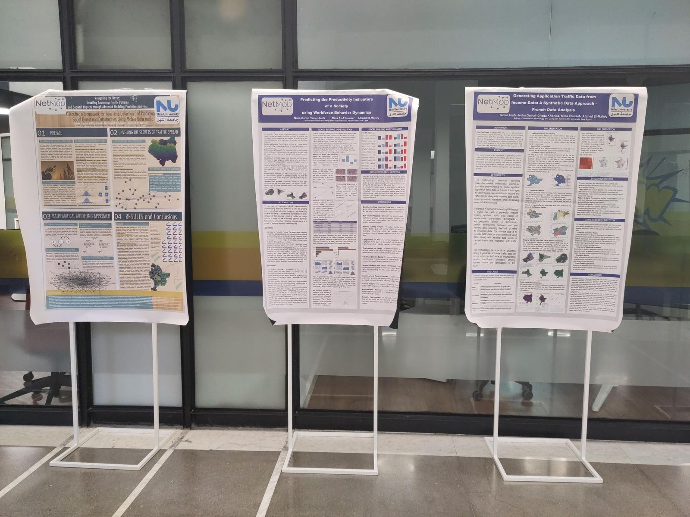
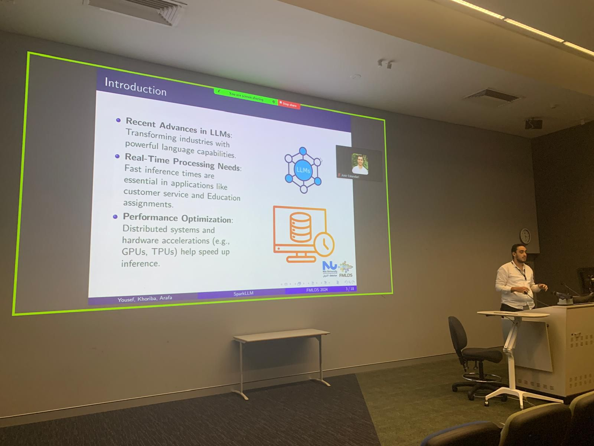
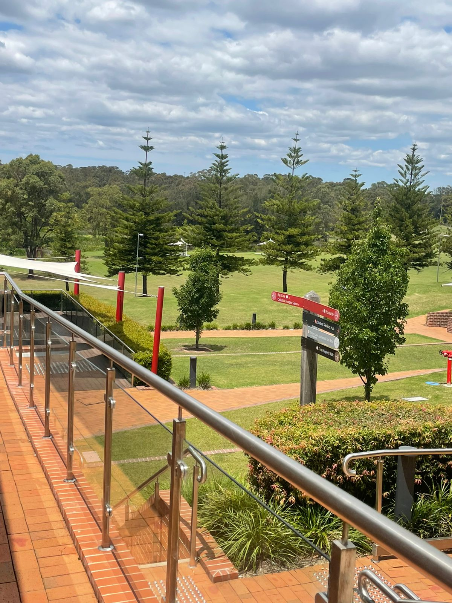

About Mina
======
Mina is a researcher, developer, and educator specializing in Machine Learning, Natural Language Processing, Deep Learning, and Large Language Models (LLMs). As a Research Assistant at Nile University, Mina focuses on enhancing LLMs for education and advancing AI efficiency.

Mina graduated with a Bachelor’s degree in Computer Science from Helwan University in 2020 and is now pursuing a Master’s in Informatics at Nile University.

Mina has taught Artificial Intelligence and Computer Vision as a teaching assistant and trained students in the Samsung Innovation Campus program. also, has chaired conference sessions, reviewed AI journals, and worked on international projects, including an internship at RIKEN in Japan.

With experience in AI, software engineering, and vulnerability management, Mina applies academic research to practical challenges, advancing AI and technology in meaningful ways.

Features
======

Posters at Netmob 2023
====

The posters showcased cutting-edge research in network mobility, traffic prediction, and data analysis at **[Netmob 2023](https://netmob.org/www23/)**.

  
  

Scene from FMLDS 2024 at Western Sydney University, Australia
====

The two papers presented at **FMLDS 2024** explore key areas in machine learning, deep learning: one focuses on advanced hybrid image segmentation for spine annotation in MRI, while the other addresses the optimization of real-time data processing for large language models (LLMs) in resource-constrained environments, utilizing Spark and GPU-driven workflows for improved performance.
